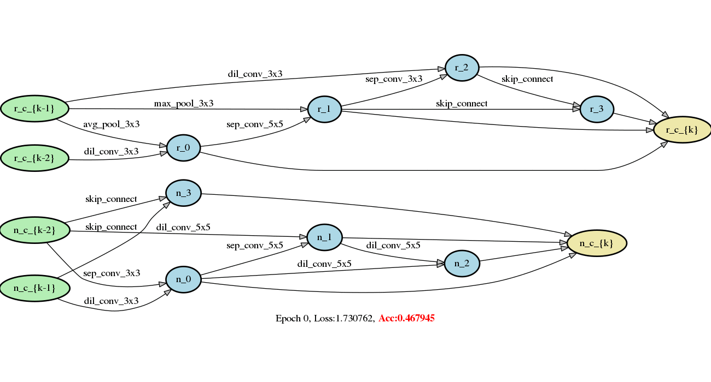

# 可微分架构搜索DARTS (Differentiable Architecture Search)

本工作基于PaddlePaddle静态图使用[DARTS](https://arxiv.org/abs/1806.09055)方法进行可微分架构搜索。
动态图方式可以参考：[PaddleSlim-DARTS](https://github.com/PaddlePaddle/PaddleSlim/tree/develop/demo/darts)

## 依赖项

> PaddlePaddle >= 1.7.0, graphviz >= 0.11.1

## 数据集

本示例使用`CIFAR10`数据集进行架构搜索，可选择在`CIFAR10`或`ImageNet`数据集上做架构评估。
`CIFAR10`数据集可以在进行架构搜索或评估的过程中自动下载，`ImageNet`数据集需要自行下载，可参照此[教程](https://github.com/PaddlePaddle/models/tree/develop/PaddleCV/image_classification#%E6%95%B0%E6%8D%AE%E5%87%86%E5%A4%87)


## 网络结构搜索

目前仅支持使用DARTS的二阶近似方式进行搜索，静态图构图时间较长，可能需要等待几小时才会开始训练,启动命令如下：
``` bash
python train_search.py
```

模型结构随搜索轮数的变化如图1所示。需要注意的是，图中准确率Acc并不代表该结构最终准确率，为了获得当前结构的最佳准确率，请对得到的genotype做网络结构评估训练。



<p align="center">
图1: 在CIFAR10数据集上进行搜索的模型结构变化，上半部分为reduction cell，下半部分为normal cell
</p>


## 网络结构评估训练

在得到搜索结构Genotype之后，可以对其进行评估训练，从而获得它在特定数据集上的真实性能

```bash
python train.py --arch='DARTS_PADDLE'            # 在CIFAR10数据集上对搜索到的结构评估训练
python train_imagenet.py --arch='DARTS_PADDLE'   # 在ImageNet数据集上对搜索得到的结构评估训练
```

对搜索到的`DARTS_PADDLE`做评估训练的结果如下：

| 模型结构                    | 数据集   | 准确率          |
| --------------------------- | -------- | --------------- |
| DARTS_PADDLE                    | CIFAR10  | 97.34%          |
| DARTS  (二阶搜索，论文数据) | CIFAR10  | 97.24$\pm$0.09% |
| DARTS_PADDLE              | ImageNet | 73.72%          |
| DARTS (二阶搜索，论文数据)  | ImageNet | 73.30%          |


## 搜索结构可视化

使用以下命令对搜索得到的Genotype结构进行可视化观察

```python
python visualize.py DARTS_PADDLE
```

`DARTS_PADDLE`代表某个Genotype结构，需要预先添加到genotype.py中

## 致谢
本工作参考了DARTS原作者的[开源实现](https://github.com/quark0/darts)
