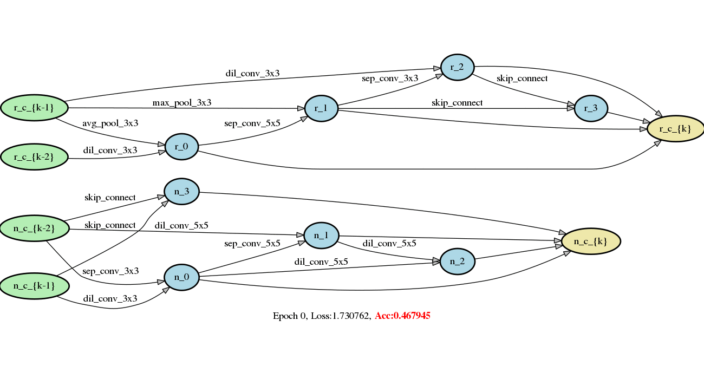

[中文](README.md) | English

# Differentiable Architecture Search

This work uses the [DARTS](https://arxiv.org/abs/1806.09055) method based on PaddlePaddle static graph to conduct a differential architecture search.

The dynamic graph method can refer to: [PaddleSlim-DARTS](https://github.com/PaddlePaddle/PaddleSlim/tree/develop/demo/darts)

## Dependencies

> PaddlePaddle >= 1.7.0, graphviz >= 0.11.1

## 

DARTS uses the `CIFAR10` data set for architecture search, and can choose to do architecture evaluation on the` CIFAR10` or `ImageNet` data set.
The `CIFAR10` data set can be automatically downloaded during the process of searching or evaluating the architecture. The` ImageNet` data set needs to be downloaded by yourself, please refer to this [Tutorial](https://github.com/PaddlePaddle/models/blob/develop/PaddleCV/image_classification/README_en.md#data-preparation)


## Search process

At present, only the second-order approximation method of DARTS is supported for searching. The static graph composition takes a long time, and it may take several hours to start training. The start command is as follows:
``` bash
python train_search.py
```

The model architect changes with the number of search rounds as shown in Figure 1. It should be noted that the accuracy Acc in the figure does not represent the final accuracy of the architect. In order to obtain the best accuracy of the current architect, please train the architect from scratch.



<p align="center">
Figure 1: The structure of the model searched on the CIFAR10 data set. The upper part is the reduction cell and the lower part is the normal cell
</p>


## Network architect training

After obtaining the search structure Genotype, it can be trained to obtain its true performance on a specific data set

```bash
python train.py --arch='DARTS_PADDLE'            # CIFAR10
python train_imagenet.py --arch='DARTS_PADDLE'   # IMAGENET
```

The results of evaluation training for the searched `DARTS_PADDLE` are as follows:

| Genotype            | Datasets | Accuracy   |
| --------------------------- | -------- | --------------- |
| DARTS_PADDLE                    | CIFAR10  | 97.34%          |
| DARTS  (2nd-order，paper) | CIFAR10  | 97.24$\pm$0.09% |
| DARTS_PADDLE              | ImageNet | 73.72%          |
| DARTS (2nd-order，paper) | ImageNet | 73.30%          |


## Architect visualization

Use the following command to visualize the Genotype structure obtained from the search

```python
python visualize.py DARTS_PADDLE
```

`DARTS_PADDLE` represents a certain Genotype, which needs to be added to genotype.py in advance

## Acknowledgment
This work refers to the open source implementation of the original author of [DARTS]((https://github.com/quark0/darts)).
